#  Signed and  Unsigned integers

通过补码的形式把加法转换为减法。

2位补码表达式:

逐位取反，再加1。或者负数mod2^n再转换为2进制。

最小能表示：-2^{n-1},最大：2^{n-1}-1


最高位舍去，因为对2^n做了取模操作。但是这里是overflow，由负数变成正数了。

小数表示：

0.625转换为2进制。(0.1010)

0.625*2   0.

1.25*2      1

0.5*2         0

1*2            1

小数点在乘法运算中较为复杂

所以要对小数做归一化，这样就变成了浮点数。


已知32位求expo，那么expo-127，已知原数求32伪，原数+127.

overflow:

underflow:denorm:把小数位拓展到2^{-23}*2^{-126}，也就是用次正规数来表示，但是underflow问题还是会存在。正规数（normal），子正规数（subnormal）：

非规格数指数部分固定为-126.用于表达（0.00000000-0.1111111）


NaN:


FP Arithmetic:

加法：

1. alignment shift（对齐小数点）
2. 对significand进行加减
3. normalize（如果产生进位）
4. round（对于小数位超出23位范围，要取整）eg：0.0000...01,最后1是第24位，最后round要去除这个最后一位，就会向偶数靠拢，最后取0.00000...0
5. 如果一直没有normalize就一直重复3,4

3.14\*10^1化为0.314\*10^2

1.314*10^2

Round:9.14*10^-22,转化为。。。.10^1(直接取整了)

round(0.5)取整到最近的偶数0。

round（1.5）取2

乘法：

1. 指数部分相加，然后考虑-127的偏差
2. significand部分相乘
3. normalize
4. round
5. 如果没有normalize重复4,5
6. 计算sign bit（XOR逻辑，110 011 101 000）


# C language


- 预处理pre-processing：

  1. 插入include的source file

  2. 宏定义

     为什么要加上括号：

     因为只是做简单的文本替换，没有括号可能会运算顺序错误：i+1\*i+1 // (i+1)\*(i+1)

  3. 把注释改为空格

- parser&semantic analysis

  1. 把code word看做token
  2. 定位每个token的位置（报错位置）
  3. 把token生成AST树（Abstract Syntax Tree）
  4. 报错

- code generation&优化：
  1. 把代码细化成计算机底层能进行的操作（lw，sw，寄存器）
  2. 优化：常量折叠...

- IR to Assembly

- Assembly to Machine code

  char 1byte

  int 4byte

  float double 8 byte

​	优先级赋数据类型：


都先看成int，但是超出了数据范围或者没有满足数值的表达（出现负数）就往下一种类型考虑。

​	Unsuffixed decimal ：int, long int, unsigned long int;

​	unsuffixed  octal or hexadecimal: int, unsigned int, long int, unsigned long int; 

​	suffixed by the  letter u or U: unsigned int, unsigned long int; 

​	suffixed by the letter l or L: long int,  unsigned long int; suffixed by both the letters u or U and 1 or L: unsigned long int


C operators:

bitwise:~(0101)=1010

boolean logic:!(0101)=0000

bitwise shift:left shift ：0101<<1 01010 [equals to times 2]

right shift 0101>>1 010 [/2 and round.]


address:每个地址能放一个byte，对于32位系统能放2^32 byte,对应4GB.


pointer：

size:correspond to the 32-bit address, is 4 bytes.

use pointer to initialize:

danges:(undefined behaviour)

```
int *pt;
*pt=5
```


Arrary:

```
char *string2="abc"
```

address is seperated into different sections. and"abc" is in the read-only section.

一站式C编程。


暂时改变了p的值，但是离开函数之后这个变化还是消失了，*p=*p+1才会变


h是指向指针的指针，必须对这个指针解引用到指针q，在函数内对指针的++才会保持效果。


array是有限考虑成指针。

a是对应一个具体数组，优先考虑成数组。


arr因为相当于指向第一个元素的指针，加一相当于加4，和p+1一样。但是p1是指向数组的指针，所以它取的是整个数组的大小+1=20.


# C Memory：


每个变量的生命周期不一样（static，global，local【函数内部】）

定义在函数之外的变量/static：存储在heap下面的两段。

- global、static（函数内定义一个static变量）描述内存：变量始终存在，哪怕函数调用结束。

```c
int f(){
static int a;//通过不断调用，a的值不断增加。
return ++a;
}
```

-  .bss for global/static initially being zero/uninitialized
-  .data for global/static with initial values

函数内的变量：存在栈内

栈：每次调用函数，stack里面就会存入栈帧

包括：

 • Return address (who called me?) 

• Arguments 

• Space for local variables

特点：栈帧采用连续内存

函数调用结束之后，所有相关的变量就都销毁。


堆：The heap is dynamic memory – memory that can be allocated, resized, and  freed during program runtime.

堆大小不够用：stackoverflow

realloc：


有可能返回NULL。原因：栈的空间不够分配就会返回NULL

>  malloc和free如何操作：
>
> 在stack里使用linkedlist和flag标记可以自由分配的空间和已经使用的空间。
>
> 


# RISV-V

ISA： Assembly Instructions Architecture

1. 算术逻辑

2. 访存

3. 有条件跳转

4. 无条件跳转


RISC vs CISC

CISC可以直接访问mem，RISC只能访问寄存器

CISV：Variable-length instructions

RISC：32-bit fixed-length instructions 


RV32I:

1. 寄存器：


PC：特殊寄存器，Program counter，存储指令地址。

32个寄存器,每个寄存器32位。

与C语言区别：寄存器没有类型，只有(0,1)

固定 x0=（0）

2. Assembly Instructions:

   - R-type:

     

     - Addition:·` add rd,rs1,rs2 (operation rd,rs1,rs2)`
   
     - Sub:`sub rd, rs1, rs2`
   
     - bit-wise: `and x5,x2,x1 `    `xor can be used for negation, let the other register be 1`
   
     - compare:`slt/sltu rd,rs1,rs2`
   
       slt considered sign,sltu is unsigned 
   
       overflow detection: unsigned:
   
     - shift:` sll/srl/sra rd, rs1, rs2`Left/Right shifts the value stored in register rs1 by lower 5 bits of  rs2, equivalent to a = b <</>> />>>c, a ⇔ rd, b ⇔ rs1, c ⇔ rs2.
   
       sign extension: for signed one, we complement the previous bits with the signed bit 
   
       left shift n bits =乘以2^n
   
       right arithmetic shift = /2 and mod(取整)
       
       function7 and func3 define which R-type.
   
   - I-Type
   
     imm is 12bit,using sign extend to compare
   
     
   
     
   
     - andi/ori/xori/slti/**sltui**/slli(shift left logical immediate)
   
     - sub has no subi.
   
     - load:` lw rd, imm(rs1) `  Load word at addr.to register rd
   
       ` lb/lbu rd, imm(rs1)`: Load signed[sign extension]/unsigned **byte** at addr.to  register rd[lower 8-bits]
   
       符号拓展例子：bug（立即数不可能16位，最多只有12位）
   
       
   
       `lh/lhu rd, imm(rs1)`: Load signed/unsigned **halfword** at addr. to register rd(similar to lb/lbu)[lower 16-bits]
   
       `la rd ,val`将Val 的地址加载到寄存器 rd中
   
     - store:` sw rs2, imm(rs1)`
   
       sh:Store lower 16 bits at rs2 
   
       sb:Store lower 8 bits at rs2
   
       
   
       注意：如何找地址，低位0从右边开始（ab），每一块都是8bit，add+1，移动到下一个单元（cd）
   
       
   
   - B-type：
   
   - 
   
     - `beq rs1 rs2 L(imm/label)` PC+L(offset), jump to the branch address,else PC+4 go to the next command.
   
     - `blt/blttu/bge/bgeu rs1,rs2,L`
   
       eg: loop
   
       每次访问数组元素，lw的偏移量都是0，但是指针+4（1*4）
   
       
       
       imm最后一位一定是0，那么写进指令可以直接忽略最后一位只取前面12位，那么指令就可以是13位。
   
   
   - U-type
   
     
   
     
   
     addi imm:sign extentision,all up bits set to be 1,and let the lowest bit of upper 20bit to add 1.
   
   - J-type
   
     
   
     `jal rd label`Jump to label (imm+PC, explain later) and save return address  (PC+4) to rd; • rd is x1 (ra) by convention; sometimes can be x5
   
     `jalr rd rs1 label` Jump to label (imm+rs1)&~1 and save return address (PC+4) to  rd
   
     pseudo-instruction:`jal offset == jal x1 offset ` `j offset = jal x0 offset` `jr rs == jalr x0 rs` 
   
     
   
     
   
      
   
   
   
   
   
   
   
   
   
   
   
   Call Conventions：
   
   
   
   a0-a7(x10-x17)： eight argument registers to pass parameters  and return values (a0-a1
   
   - 
     
     **Caller Saved寄存器在函数调用的时候不会保存**
   
   - **Callee Saved寄存器在函数调用的时候会保存**
   
     > 这里的意思是，一个Caller Saved寄存器可能被其他函数重写。假设我们在函数a中调用函数b，任何被函数a使用的并且是Caller Saved寄存器，调用函数b可能重写这些寄存器。我认为一个比较好的例子就是Return address寄存器（注，保存的是函数返回的地址），你可以看到ra寄存器是Caller Saved，这一点很重要，它导致了当函数a调用函数b的时侯，b会重写Return address。所以基本上来说，任何一个Caller Saved寄存器，作为调用方的函数要小心可能的数据可能的变化；任何一个Callee Saved寄存器，作为被调用方的函数要小心寄存器的值不会相应的变化。我经常会弄混这两者的区别，然后会到这张表来回顾它们。
   
   ra: one return address register to return to the point of origin (x1) 
   
   Also s0-s1 (x8-x9) and s2-s11 (x18-x27): saved registers
   
   调用函数过程：
   
   1. Caller put parameters in a place where function can access  them (a0-a7, or stack when registers not avail.), and then save  caller-saved registers to stack (e.g. ra, a0-a7,t0-t11)调用函数的那个叫caller
   2.  Transfer control to callee function (PC jump to function):  jal/jalr, ra is changed to where caller left
   3. Acquire (local) storage resources needed for function: change  sp (size decided when compiling); Callee push callee-saved registers to stack (e.g., s0-s11)
   4. Perform desired task of the function
   5. Put result value in a place where calling code can access it (a0,  a1), and restore/pop callee-saved registers (s0-s11, sp)
   6. Return control to point of origin, since a function can be called  from several points in a program (jr ra); caller restores caller saved registers
   
   caller: 
   
   callee: Callee push callee-saved registers to stack (e.g., s0-s11) saved register need to be restored, cuz it is saved before called. return value is put into a0,a1.
   
   

​	调用函数调整sp，sw ra，最后返回是lw ra（leaf不需要）

每调用一个函数都压一下栈，记录一下ra到先开的的栈的位置

如果调用函数的参数之后还有其他用处，就需要把这些参数sw进栈帧上。再用lw恢复参数，最后弹栈。

一些递归的代码例子：


链接：

 在assemblycode翻译成machinecode之后，把不同文件里需要互相用到的函数等内容链接起来。

eg：

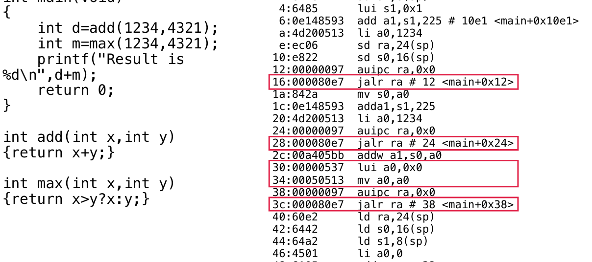

这里在编译成汇编语言的时候不知道add和max函数在哪里，只是记录一下出现这种情况的汇编语句在哪里，然后到了链接时候，text段内存已经存好了main，add和max，那么找到有问题的语句再链接一下就可以了。

 Input: object code files, information tables (e.g., .o,  libc.o for RISC-V) 

• Output: executable code (e.g., a.out for RISC-V) 

• Combines several object (.o) files into a single executable  (“linking”)

  • Enable separate compilation of files

 • Changes to one file do not require recompilation of the whole  program • Linux source > 20 M lines of code!  

STEP:

 Step 1: Take text segment from each .o file and put them  together; Take data segment from each .o file, put them together,  and concatenate this onto end of text segments 

• Step 2: Determine the addresses of data and instruction labels 

• Step 3: Resolve references

 • Go through relocation records; handle each entry

 • That is, fill in all absolute addresses


loader：


 Reads executable file’s header to determine size of text and data  segments

• Creates new address space for program large enough to hold  text and data segments, along with a stack segment 

• Copies instructions and data from executable file into the new  address space 

• Copies arguments passed to the program onto the stack

 • Initializes machine registers 

• Most registers cleared, but stack pointer assigned address of  1st free stack location

 • Jumps to start-up routine that copies program’s arguments from  stack to registers & sets the PC 

• If main routine returns, start-up routine terminates program  with the exit system call


compile：C代码翻译成机器码，assemble再去翻译成机器码。

CAL链条：

compile->assembly->link(static lib)->loader


# Digital Circuit

## 组合逻辑

数字化电压，把电压、信号就看出0,1.

晶体管：CMOS把NMOS和PMOS互补。


> 这是一个非门。

A输入，O输出。上面是高电平，下面接地（低电平）。

A逻辑1，下半部分开启，输出是0,。


> 再与notgate串联即是andgate


LAWS：


半加器和二位加器


绿色框：ABD为1

蓝色框：CDB为1

红色框：AC为1

全加器：低位的carry给到前面的全加器，前面的全加器的进位再给到前面。

for beq instruction:

很多个亦或非门练到AND门上面，判断每一位是否相等。

选择器：


输入Sel为0，那么C等于A（选择A）

逻辑上就是：BSel+A!Sel

Multiplxer


## 时序逻辑


上升沿进行采样。

reset为1，register清空为0，enable为1，sample并且up达特1，为0就保持状态。


寄存器：时钟上沿的时候进行采样。


**Moore machine：**

输出标注在状态上

输出只与状态有关，

输出的变化仅由时钟的信号来控制。（当然还是可能包括延时）

**Mealy machine：**

可以在时钟的任意时刻发生变化（由input来决定）

输出还与输入有关。

输出标注在input上：


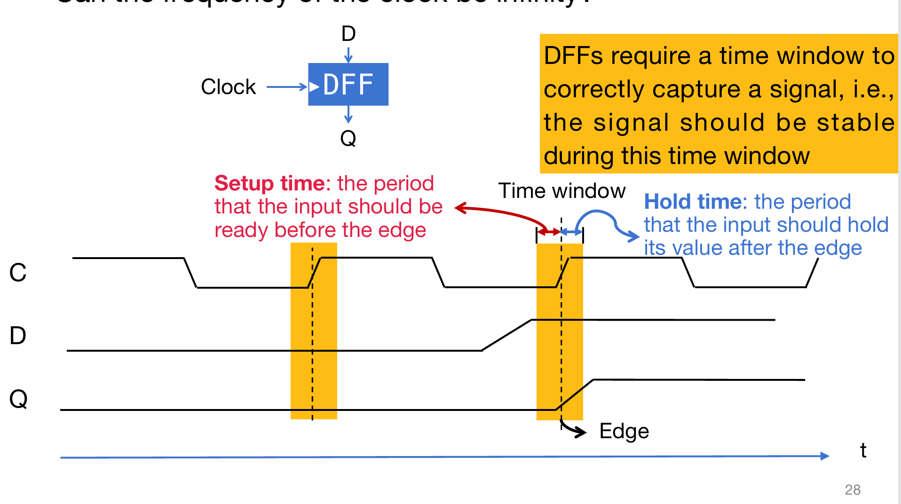

setup time 之前和holdtime左右一个区间要保证信号是稳定不变的。

eg：失效电路：


采样频率太快了，延时时间跟不上，导致采样的时候信号不稳定，采样失效。

所需要满足的边界条件;


实践：

1. 构建FSM
2. 根据状态列出真值表
3. 根据真值表搭建电路（考虑与门、非门、或门等）


用多选器实现移位：

使用32个选择器：


指令的选择。输入输出都是32位。


加法器的设计：共32个加法器，最低位的进位信号是0


减法：32个加法器最低位进位设置为1.

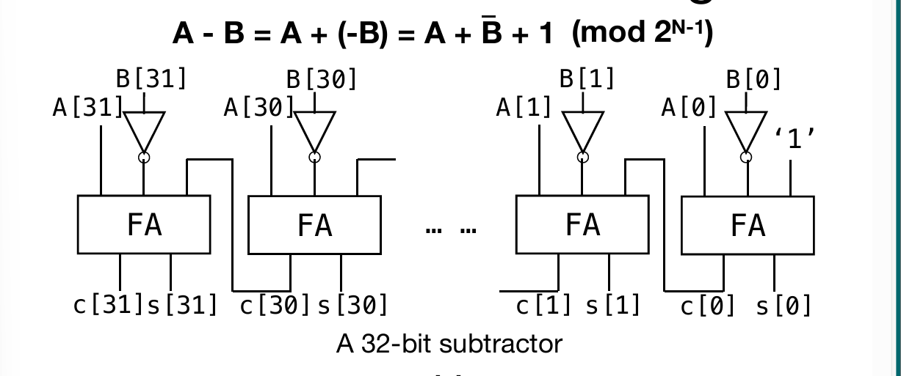

合二为一，

直接通过在输入前再加上一个xor门，sel信号用多选器来选择是加还是减法。最后进位也用个选择器来选择。


输入如何给到特定的寄存器：

将input连给每一个寄存器，


要输出两个寄存器：

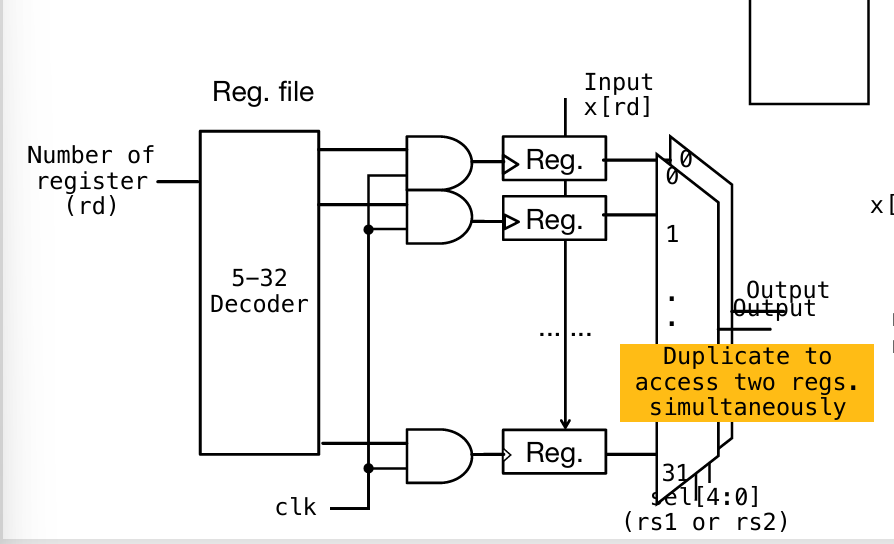

用one hot调整要写入的reg


blocks-Memory：


# DataPath

R-type：


## I-type：

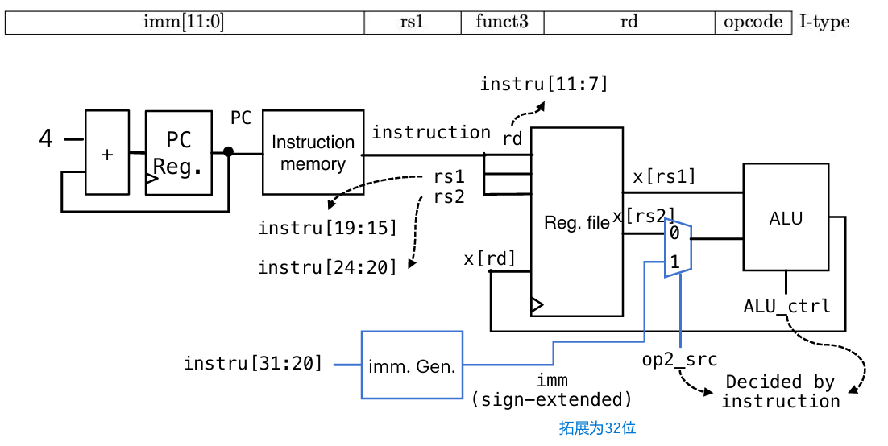

为了执行lw：


多加的功能，reg到alu有一个多选器选择是否是imm，alu之后有个多选器选择是否去memory里取数。

如何实现lb、lh：对于lw，直接把32位数据写回reg。但是lb、lh要考虑符号拓展，拓展为32位。lb低八位总归是从memory里读取的，再高八位选择sign还是unsign。所以需要一个多选器选择第二个八位，以及选择高16位。


## S-type：


读取是不受clk限制的，

Stype是写使能，Itype是读使能。

和I都需要对指令里面的imm进行符号拓展变成32位：	

同时，stype并没有把数据返回给reg，所以要在regfile里面添加reg_en，等于1才可以写数据。


具体对reg的控制，相当于没有时钟上升沿没法读入数据，但是读取是不受clk控制的：

​	


## B-type：


处理imm：


判断条件是否相等：


只要or门里面存在一位1，就说明两个数据并不相等，输出就不是零。


对于PC的选择前面再加个判断是否是beq指令，防止其他类型产生干扰。

isbeqinstruction:

随意设置alu-clt（控制多选器的值），因为判断是否为zero是直接接在sub后面的or来判断的，又因为既不会写回，随便什么都可以。


设置controller：

于是又抽象成：


## timing：


instruction fetch：

decode：读取数据是不需要时钟的，也就是不需要setup time，

execute：

write  back：setup是寄存器启动时间


	


# PipeLine


一般情况下，指令翻译，CISC比RISC要更少，但是CISC比RISC的电路硬件会更复杂，所以运行频率可能会更小。整体性能和RISC，CISC不太有关。

compiler对代码优化可能可以减少翻译出来的instruction数量。

编程语言C语言执行效率比py好。

CPI：如果存在并行，那么每条指令所需要的时钟周期会小于1。ISA，CISC会比RISC复杂度高一点。

最后那个是clock-period。

例子:


优化方向：注意到C类占比大，CPI大，可以考虑减少占比。


流水线：


相比于每个周期执行一条指令，流水线的每个时钟周期变短了。主要提升了cpuu time里面的cycle（time/cycle）

为了避免流水线堵塞，将时钟周期设置为最慢的那一部分所需要的时间。时钟周期控制流水线寄存器，先把取到的东西锁在寄存器当中，时间到了才放行到下一步骤。


IDreg里面要传递给下一层的有需要的寄存器，目标寄存器，执行的运算信号。


会存在两个可能存放rs2的部分，对于sw来说一部分是要用于input的rs2，一部分是imm。


- hazard：

  1. structural hazard：硬件上不能支持同时操作读写。要解决可以考虑改造硬件、也可以调整指令调度，让产生冲突的指令往后延迟一个时钟周期，但是会导致效率下降、但问题是可能会与其他指令冲突，所以需要一直向后延迟知道没有冲突。

     

  2. data hazard：读取到了没有更新的值

     ​	解决：1. 等到更新结束，中间插入两条nop指令。

     

2. 直接把计算结果存储起来，经过两个寄存器，在两个周期之后给到指令，这样就不需要等待了。


问题是：这样万一没有data hazard不就会发生冲突吗？

解决：加一个多选器

op1_src如何判断：判断写指令的rd是否相等与读指令的rs（reg_en）


对于lw：

不可避免地需要等待，并且直接把值从mem forward到alu

可以通过调节指令顺序来调整冲突。


对于sw：

直接通过把alu的值放到给mem输入的那个寄存器，

3. control hazard

   beq之后传进流水线的指令可能并不是beq做完结果之后想要执行的指令。

   当beq终于得到了结果，此时已经load错误了4条指令。

   - 考虑加气泡

   - 做预测：

     假设PC+4，但预测错误了，由于状态已经被改变了，所以需要flush。所以相当于延迟加了超过4个周期。

     更动态的预测：根据上一次branch是否taken，上一次taken下一次也taken，反之亦然，四个状态taken（课本）

     

   - 也可以提前用得到branch是否taken。


# Multi issue

指令的并行：这里主要讲的是提升每个cycle的指令数量。CPI对于两条并行变为0.5.

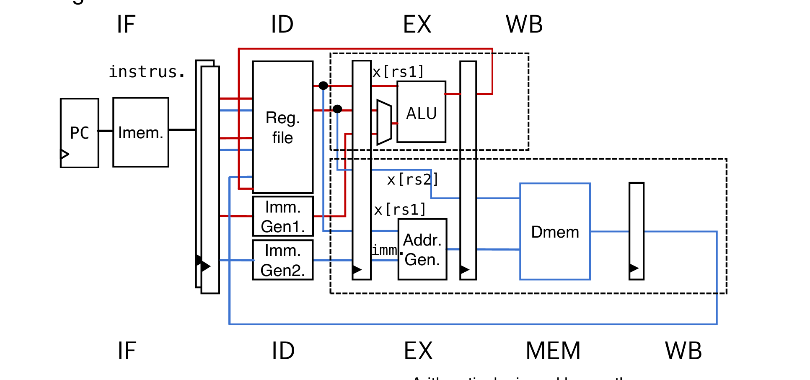

指令分区并简化。


alu类指令和l、sw指令两两搭配。现在理想情况下每条指令只需要0.5周期


图中含有forwarding

对于1000次循环，可以把指令写成多条减少循环次数。


对寄存器的重命名：减少datahazard，之后再对指令重排序。相对照与1000次循环，减少了nop的插入，

1. 静态VLIW

   Package instructions into issue  slots and detect hazards  statically (at compile time mostly) 

   • Hardware may also  detect/resolve hazards 

   • Also called VLIW (very long  instruction word

   主要是compile对流水线中指令排布进行排布优化。

   二发射设备移植到4发射设备就徐亚重新设计compiler。

2. 动态 superscalar

   主要依靠硬件处理datahazard。对compiler要求较少。

   > amd64向下兼容x86

   

   等待的时候让其他指令先去执行。可能存在hazard的寄存器先存在reservation里面。指令执行的顺序可能OoO（乱序），但是commit的时候是inorder commit。把正常是在后面执行但是实际上更快执行的指令结果先存在reorder buffer里面，等到前面按照顺序做好commit里面之后再commit。

   SIMD:同一条指令add，包括一个向量的变量【a1,a2,a3,...】使用多个ALU，但是有多个数据，但是同时只能执行一种指令。可以与Multi-issue进行结合。

   Multithread线程：不同段汇编代码。可以与Multicore结合。


# Cache

目的：保证存储数据多的同时让速度也加快。

RAM：会刷新，会丢失数据。

- DRAM：一次可以拿到64bits，任意时刻对任意地址拿到数据。（random access）由电容提供数据。
- SRAM：晶体管提供数据


Memory Hierachy：

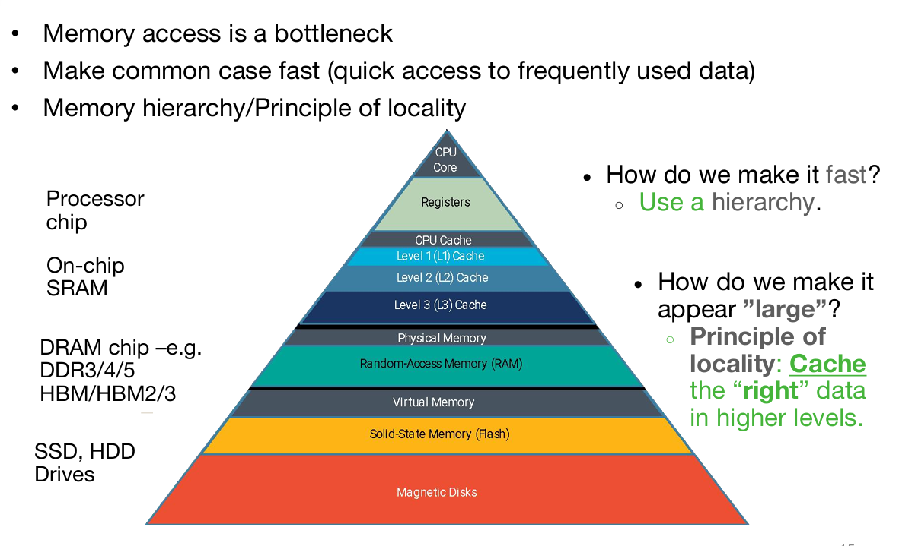


- 局部性：locality

  spatial locality：短时间内反复去访问一个地址附近的地址。

  eg：访问PC，每次都会+4，如果跳转到别的地方就破坏了空间局部性

  temporal locality：一段时间内一直访问同一个地址。

  eg：loop

​	

特殊情况：数据结构如linked list和tree会可能破坏局部性

Cache controller：硬件自动化管理


regfile从main Memory是程序员可以手动调节的（lw，sw）

，但是Cache不行。reg对Cache发起请求，Cache里有就直接给reg，没有就进入second-level，向main Memory发起访存请求。


> cache miss
>
> cache hit

评估标准：miss-rate高，访存速率就慢。二级的命中率会更低。

hit-time命中的时候访存需要的时间。


- Cache的设计：

  

- associativity:衡量缓存每个组可以存放多少缓存行。越大，命中率约大，访问速度越慢。

## fully associate：

主存块可以放在缓存的任意位置，无任何限制。没有index，仅依赖tag。

- | **冲突率最低**，缓存利用率最高。 | **查找速度最慢**（需比较所有行）。 |
  | -------------------------------- | ---------------------------------- |
  |                                  |                                    |

  **为什么全相联缓存查找慢？**

  因为每次访问需要**比较所有缓存行的 Tag**（硬件上需要并行比较器），而直接映射只需计算 Index 直接定位。例如：

  - 直接映射：1 次计算 + 1 次比较。
  - 全相联：N 次比较（N = 缓存行数）。

  

  

  开启新对话

  如何在cache里查找某地址的数据在不在？

  catch capacity指的还是data总共的大小。

  

  

  

**load操作**：

对于8 bytes cache block：

16bit的地址，后三位用作offset（按照cache的单位byte数量），前13位用于地址比较，存在cache

全相连fully associate:


valid bit：0说明是invalid的数据，还是相当于发生cache-hit。为什么需要：

lru：记录最少被访问的数据，当cache满的时候，替换lru最大的那个。没有访问一次，就加1，一旦访问就清0.更新的时候只会更新比它更小的lru，自己清零，其他比它优先级更高的会加上1.

发生miss，那么给到cache的数据是去除offset位的。


其他替换规则：

1. 替换最新使用的最近的access

2. first in first  out，替换最老的

3. last in，last out，替换最新的那个

4. random，

   后三者硬件开销会小。

**store操作：**

写穿：同时写cache混合memory，缺点是执行时间比较长。

写回：只有在这一条cache block被替换掉的时候会写回到main

> 判断是否需要做写回，标志位叫做dirty bit。表示是否被改写过。替换的时候需要检查dirty bit。同时需要对LRU进行更新，需要清零。比它优先级更小的lru再加1。
>
> 
>
> 
>
> 

write——allocate：

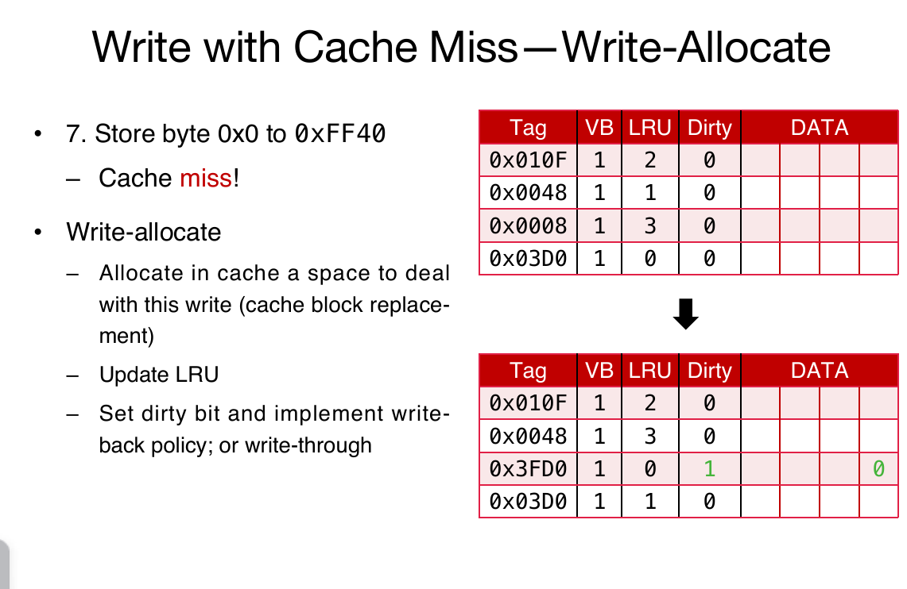

ppt勘误：3,2,0,1

fully allocate的缺点：硬件开销比较大需要很多comparator，需要注意比较tag，并且可能需要额外维护LRu等。


## direct mapping


o=log2data bytes

i=log2 index number

映射关系是固定的：在地址上抽取四的倍数放进index=0的地方。所以**没有replacement policy**


蓝色是除4余下1


7位地址去除最高位

   另一个判定依据是去除offset位置%tag数（0110的话对应2）


t-bit comparator*N


由offset来决定取data部分的哪部分。


**sw：**


buffer：先把东西给到buffer，不需要等到完全写回到下一层memory再去执行接下来的访存。

由于大小固定，可能会满，这个时候就需要等待了，同时要确保写入速度和下面写入下一层mem的速度要比较平衡。


这里和fully associate的区别是不需要lru。


nonwrite是和fully一样的

**三种cache miss**：

1. compulsory（cold start）：第一次启动cache的时候一定会发生miss。无法避免，但可以减少消耗。比如instrction cache。正常来说每次都是+4，那么可以增大cache block，第一次读PC，那么一次性多加载n个4B。但是问题是如果capacity没有提升那么只是存储了集中的访问

2. capacity miss:cache容量不够。考虑增加但会增加访问速度

3. conflit miss：由于map规则，不同数据会竞争同一个block。对于FA不会产生这种情况。

   

最坏的情况：


每次取0a[0]a[4],offset+=16


## Set associative

维护LRU的时候主需要再set内部进行维护就可以了。

Increasing associativity  decreases number of sets while  increasing number of elements per  set. 


AMAT：Average Memory Access Time


提升cache表现：

1. 减少hit time：缩小cache容量，但是会有capacity miss
2. 减少miss rate：Program dependent（比如每次访问0,4，正好每次都替换）、larger capacity、higher associativity（多条地址竞争同一个index，但是这个时候需要额外的硬件，还需要考虑replacement policy，）、larger cache blocks（影响时间局部性，固定总size，block size增大，cache 条目更小，导致只能从内存中取到某个点访问，这样会增加miss rate。一旦发生miss，整个大段数据就会被替换，但是之后重复访问这个地址就会miss。）

需要选择优化程度最大的。并且福祸相依，要综合考虑。

3. 减少miss penalty：

   - prefetch：

     提前了解到之后会使用到某些数据，就提前把数据取出来。比如把ALU之后要用的数据提前取出。（lw x0 0（t0）只是把对应地址的数据放进cache里面）

     但是预取的数据会占用空间，所以一般考虑放到最后一层cache。

   - 增加cache level：

     但是增加了硬件开销

   - victim cache：
     有一个fully associative cache存储被剔除的数据。从而避免之后会用到被踢出的数据。

   

# Paralellism 

20s前，cv^2f中的v不会随着晶体管缩小而缩小。2000之后v不再变化，但是c很难变小了。只能提升并行。频率上不去了但是晶体管数量还是还是上涨的，所以考虑单核转变为多核。

问题是软件如何适配硬件。

两种基本方式：

1. Multiprogramming：

   - 不同任务分配到不同的核（任务之间独立）

   

2.  Parallel computing (parallel processing program）：

   


Amdahl‘s law: 


strong scale对应amdahl定理，增加S。

当程序无限扩大倍放入main Memory中，这个时候频繁发生cache miss，这个时候会影响weak scaling 的能力。这个时候Memory Hierarchy会造成影响。


- SISD: Single instruction, single data 

## SIMD

 Single Instruction, Multiple Data

1. 加速矩阵运算的计算单元：FMA

2. DLP：data-level parallelism：Executing the same operation on multiple data stream。（每个操作之间是互相独立的）

   

3. 好处： 

   - SIMD architectures provide performance improvement for DLP 
   - One instruction is fetched & decoded for entire operation 仅需要一次
   - Multiplications are known to be independent 
   - Pipelining/concurrency in memory access as well 
   - Special functional units may be faste

4. 

   每次相乘5ns，到下一次取8条数据，需要10ns，所以每次执行单元都需要等待访存。所以就产生了mismatch，这个时候可以流水线化，增加访存带宽。

5. 需要多个alu

6. 寄存器位数拓展，比如128bit，放4个32bit数据。

   > 什么叫做packed double-precision？
   >
   > 

7. intrinsic functioon：

   

eg:

loop unrolling:


< 这个例子只是SISD

RV32I拓展：M、F（浮点数拓展，用到FPR，32个f开头的浮点数寄存器）


矩阵乘法：

为了方便讨论，以主列的顺序放入元素


可以并行的部分：


Element-wise computation of Cij; 

Multiplication of Aik and Bkj

发现B11和Ai，1的两个乘法是可以并行的


最终将N^3数量级的循环次数转换为2次。

- MIMD:Multiple Instruction, Multiple Data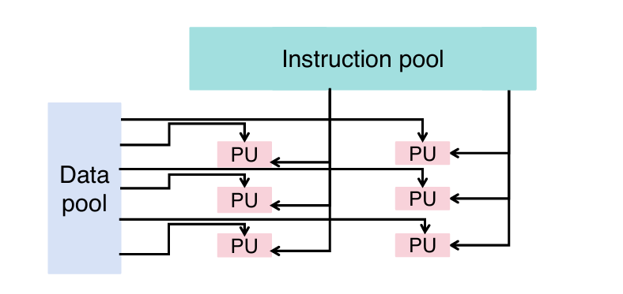(多核)


## Thread-level paralellism

 • Threads (short for threads of execution) is a single stream of instructions. 线程

• Each thread has:

​	 • Its **own registers** (including stack pointer)

​	• Its own program counter (PC) 

​	• Shared memory (heap, global variables) with other threads 

• Each processor provides one (or more) hardware threads (through multi-core or  single-core multithreading, later) that actively execute instructions

单核也可以执行多线程程序。多个thread 共享文件，那么同时读写会造成冲突。不同thread如果放入不同核，需要考虑分布，每个核均匀分布，并行最大化（OS来进行任务分配）

• Within a given program’s process,  threads can run concurrently. 进程：一个应用，可以对应多个线程。浏览器的每个标签页，操作系统同时运行的多个程序

• Operating system (OS) multiplexes  multiple software threads onto the  available hardware threads

同一个任务有不同的线程，不同线程之间执行可能独立但可以互相共享数据。


### MIMD


单核处理多线程：

方法：time-multiplexing


时间上进行任务分割。

OS如何调度thread：

因为active的thread数量会远大于可用核的大小，所以大部分thread都是靠**context switch**来调节的。有点像time multiplexing，比如先放入多个thread并且执行一段时间后换thread


切换的时候要把数据都存起来。换到另一个thread也要把需要的context（PC等）放进来。由于切换速度比较快，人体感知不到，使用者的角度看来就是并行化处理。


**OpenMP**

```C
#include <omp.h>
 Use pragma, e.g., #pragma omp parallel
 cc –fopenmp name.c
```

例子


线程有自己的id，main是0,但是执行顺序不是按照id大小来的。

- 一些函数：


#logical core：physical core*thread per core

默认情况下omp_set_num_thread就是logical core的数量，这个数量代表能使用的最大线程数量。

- 变量：

  共享:

   ○ Variable declared outside of  parallel region

   ○ Heap-allocated variables ○ Static variables

  私有：

   ○ Variables declared inside  parallel region (recall  separate stack frames)

  

  > 这个例子里面#后面写了private（var2）使其变成私有变量

四种方法：


第四种方法的简写：


- data race

  

  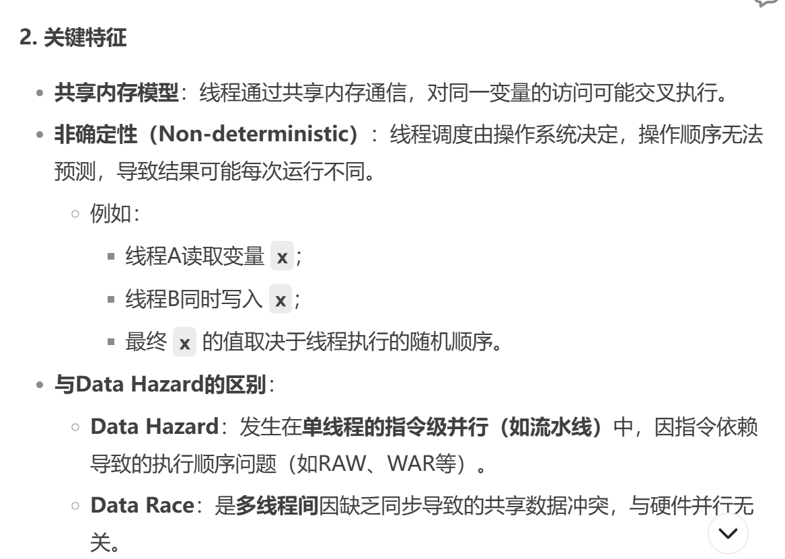

  由于线程调度顺序是不确定的，所以运行结果可能不一样。

  为了使运行结果固定：

  - Synchronization：

    1. 软件实现：

    

    这个时候不得不顺序执行，这块内容叫做**critical section：**

    

    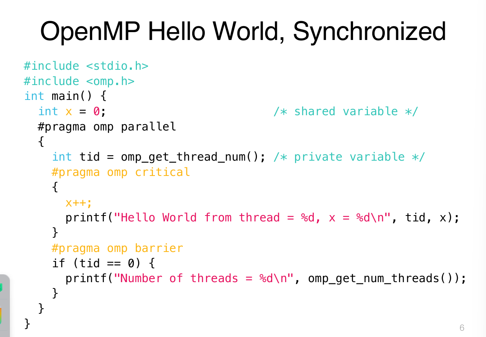

    最后输出结果应该是：

    > hello。。。id还是打乱的，x=1
    >
    > hello。。x=2
    >
    > 。。。x=3,4...
    >
    > Number of thread：。。

    2. 底层实现

       lock synchronization：

       

       

       还是有问题：
       
       没写进去就读了。
       
       解决：
       
       
       
       lr指令会在底层将reservation set 置为invalid，这样在后面sc的时候就会根据reservation set 来确定是否写入并在寄存器这一层改变t0的值，
       
       ```
       li t2,1
       try:
       lr t1,s1 #拿到锁当前的状态
       bne t1,x0,try
       sc t0,s1,t2 #
       bne t0,x0,try
       locked:
       #critical section
       unlock:
       sw x0,0(s1)
       ```
       
       sc会检查RS，合法就把t0置为0代表上锁。成功写入之后，那么unlock。
       
       
       
       Op2：
       
       
       
       先把原来（rs1）的值给到rd，
       
       
       
       .aq设置一个障碍，告诉硬件，保证critical section在优化性能（代码重排）的时候，不会在上锁之前执行。
       


## SMT

Simultaneous Multithreading

在CPU内部完成context switch，不需要再从内存加载pc和data，直接通过切换不同的寄存器部分。


通过加multiplxer选择不同的thread环境。通过复制部件看起来两个核但实际上只有一条流水线。


两条指令之间不会有hazard，

ALU可能是限制的瓶颈。

额外的开销：一条线程没有工作的时候还是在耗电的。

SIMD（DLP）是复制ALU，一次性多次处理运算，也会有单独的register file。需要是相同操作并且data之间没有依赖关系。

Multi-issue ILP：考虑各种data hazard

Multi-core TLP:多条流水线，和SMT都需要做数据之间的同步（软件实现，比如lock）


# Multiprocessor with Shared-memory

总线:连接不同processor和Memory还有I/O的共享数据线。

coherence miss:

当多个processor共享同一块地址上的数据，其中一个处理器改动了它的值，另外的processor的cache里存的就是之前旧的值。比较有效的方法是直接从修改值的processor的cache里拿值。

> cache block增加状态。
>
> Invalid-> Shared->Modified取数据，
>
> Shared：可能是共享的，更新的数据
>
> Modified：更新的数据但是只有一个processor有这份数据。
>
> Exclusive：只有这个processor有这份data，这个时候就不需要check其他的cache
>
> Owner：虽然是共享了数据但只有owner能改变这个数据

Snooping：监听

Snoopy cache:

Write invalid：先把要写的地址发到总线上，其他处理器检查cache里是否有这块地址的数据，设置为invalid。但不会额外更改数据。优点不会过分占用bus资源。

WAW:如果之后还是它来写同一个地址，可以先检查其他process的validbit是否是0，如果都是0就不需要把地址放到总线，节省带宽。

Write update：每次更新就把更改的值广播到其他有它的cache。（问题是大量占用bus）


False sharing:


实际上修改的是同一个tag的不同块，因为不是同一个数据所以可以不用做snoopy的，可以考虑减小cache size。


bus需要保证只有一个processor可以使用bus。


# Advanced cache：

inclusive：下层cache包含所有上层cache的内容，L2当中的数据被evict（剔除），L1的数据没有被剔除，就把它的valibbit设置为0.只需要通过L2维护coherence。

> 严重问题：L1是MRU，L2是LRU，L2被踢出，L1也没了

exclusive：L1和L2当中的数据没有交集。L1miss就直接从Memory当中读取到L1而不是L2，踢出L1的数据就把这个数据放到L2的位置。

Non-inclusive：

L2cache当中踢出数据不需要管L1，但是在维护coherence时候还要考虑L1。还可以放下更多不同的数据。

   


# OS


Boot的时候发生了什么？

1. CPU会从起始地址开始执行指令。BIOS（Basic Input Output System）芯片操作将硬盘第0个扇区操作系统有关的代码放置在内存当中启动操作系统
2. 加载kernel
3. 启动各种服务（网络...）\driver
4. 等待输入


常用的IO设备：SSD

如何通过操作系统管理到IO设备

输入设备：读取

输出设备：写入

把IO当作内存中的数据。也就是将这些设备映射到内存当中进行读写。MMIO（Memory Mapped Input/Output）


数据交互的两种过程：

1. Polling

   每30次一秒进行一次对control reg的check，如果是1，那么就开始对data reg执行操作，（load or store），IO reset control reg 为0

   

   

   

2. Interrupt

   没事不打扰，有事interrupt.查表是那个设备interrupt，用interrupt handler处理。结束之后回到原来的线程进行指令的执行。

   interrupt和exception区别：i是由外部设备进行的打算，独立于程序存在。exception是计算机本身发生的事件导致的。比如非法的指令。（nan，overflow，访存越界，代码执行中发生的）

   precise trap：trapped之间的指令已经完成，并且可以完整返回到中断的位置。SEPC寄存器来保存地址。

   Handling trap（in-order）：

   exception必须停在commit point处理，后面1指令发生exception会因为流水线而被很好的处理。先执行handler的指令再进行下面指令的执行。

   

   在commit point插入inte

   同一条指令在不同阶段都会发生exc：此时由于前面阶段发生ex后面阶段都没有意义了，那么只需要对前面阶段进行处理就行。

   int和ex同时发生，就看谁优先级更高

   

   

   这些寄存器记录exception发生的原因，并给到最后一级流水线，查询handler的位置，并做跳转，记录exception发生的指针。

   

管理程序：

sys call：printf、ecall，操作系统功能

计算机在对文件进行读写也是操作系统提供的服务。

进程管理：

只有操作系统能调用到fork功能，


# DMA：

. Allow I/O devices to directly read/write main memory; 

• New hardware: the DMA engine 

• DMA engine contains registers written by CPU

释放CPU，让它能做更多其他事情。


这个engine放置的位置：


总线问题：

只做DMA

切换DMA和处理器

总线空闲的时候再完成DMA

# Vitural memory


在程序运行的时候动态管理虚拟内存。程序执行完毕对应的虚拟空间就会被抹去。

为什么会有虚拟内存概念：

程序碎片化，程序剩余的空间可能产生比较小的空洞。


访问单元：页。一般页的大小是4KB，大小是log2（4KB）page offset。


地址的映射：


offset是一样的，只需要把怕个number转换一下。

page fault：数据还在磁盘上没有搬运到内存上。exception，会通过DPN把页放入physical page number。

 

 每个进程有单独的地址映射，单独的page table。

page table放在哪？

0x00000000-0xffffffff,其中后三个是offset的话，page table entry就是2^20


放在cache显然不够，所以放在main Memory当中，所以page table一定是物理地址，会有一个怕个 table base register记录他的物理地址。也就意味这每次做translation就要访存，拿到地址再去physical Memory中，这是第二次方寸。先忽略cache


保护位，一般用户想要访问的话会被禁止。这个table只存放映射关系，没有数据！

1. valid bit

   由于从disk里面拿数据之后，page table可能已经满了，需要策略来进行evict.

2.  dirty bits

   write through 不好。所有虚拟内存都是需要Write back的 dirty bit。When a page gets replaced: • Dirty bit on: Write outgoing page back to disk. • Dirty bit off: No disk write.

3. 

   通过保护机制实现不同进程之间的隔离，不让其他进程进行访问。不让user进行访问。

Multilevel page table


拿到p1的10bit代表二级页表的位置（指针），能访问到2^10个L2位置，第二段的10bit能在二级table中拿到2^10个physical pages，对于unused的情况，如果存在unused的数据，这个时候并不需要对它进行存储。（程序的稀疏性，只需要开头和结尾两端的数据），还可以对L2页表进行优化，不常用的就放到disk，实际常用的只有3-4个。

 

多层page table带来的问题，需要多次访存。需要一个中间商，就相当于cache加速translation。

设计思路：缓存常用的页表项目。

TLB: Translation Lookaside Buffer，一种cache，但是不放数据。

a cache of VPN-PPN  mappings.

如果在TLBhit，那么就无需PTW。组相连的目的是为了减少比较器的数量。miss之后要在TLB中进行替换。

每个pagetable都是单独的进程有自己的，context switch的时候，可以考虑把TLB的内容置为Invalid，也可以用status来

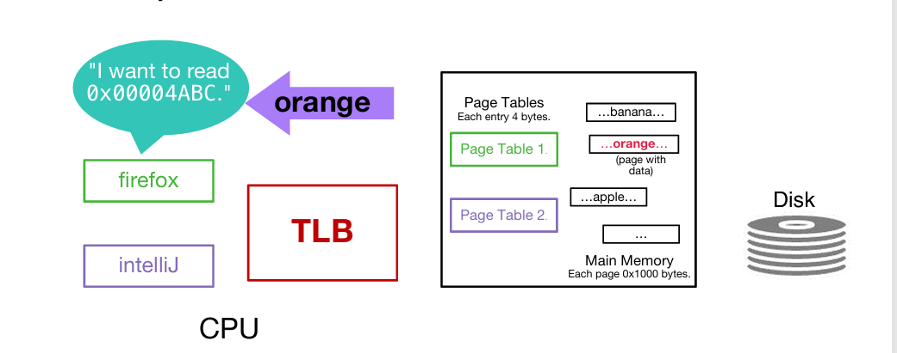

page fault是一种exception、虚拟内存可以对不同进程之间isolation，访问到非法地址，也是一种exception。两者对应的cause是不一样的，前者是process trap，后者是protect violation，这时候会直接中断在trap handler处。


physical tag physical index，先做地址的翻译再做访存。


Fault tor:

# dependability:可靠性。

MTTF：平均从正常到失败的时间，mean time to failure.

MTTR：坏掉到修好之间的时间

MTBF：两次失败之间平均的时间。

MTBF=MTTF+MTTR

AFR：每年的failure rate。


failure可能发生的地方：内存（因为读到的很多是）

error detection、correction code：在实际要编码到的数据上添加冗余的信息。

hamming distance：位数差异的个数。

parity bit：

有效编码之间最小的ham distance也会是2，但是如果不是有效的就可能会小于2.比如000-》0001,（odd parity），这时候001-》0010,010-》0100。。。这时候如果出现0011，那么ham dis《2，肯定不是有效的。

奇偶性计算是通过xor计算。算出来多少就补这个值，再做xor计算算出check bit。

> 这种方法无法检测偶数个bit发生反转的情况。


hamming 编码：

在2^n的地方放入parity bit，从一开始放。

第一个pb，会让所有奇数位置上满足偶校验。（1,3,5,7）

第二个（2,3,6,7,10,11）

。。。

判断错误，把对应发生错误的parity bit位置数码加起来就是发生错误的位置数码。出现double error也是只能定位不能修正，出现三个错误，有可能无法检测。

多个盘上存相同的数据，写的时候会有额外开销但是读的时候可以同时通过读取不同盘读到不同的数据。这个时候其中一个磁盘出现问题还能读其他disk，不算入MTTR。


parity disk：

如果disk2整个失效的时候能通过其他正确的盘反推它的正确数据。


对于disk4，如果a0a6都变化了，要对disk4进行多次写入操作。


解决：把parity bit 分到不同的盘上进行。

最后在整体前面加上一位


### **请求级并行 (Request-Level Parallelism, RLP)**  
**流程**：  
1. **任务分解**：  
   - 系统将**独立请求**（如用户查询、API调用）分配到不同处理单元。  
   - 示例：Web服务器将100个HTTP请求分发给10个后端服务器。  
2. **并行处理**：  
   - 每个处理单元**独立执行任务**（无需共享数据）。  
   - 负载均衡器动态分配请求（如Round-Robin算法）。  
3. **结果聚合**：  
   - 处理单元返回结果，由协调组件（如网关）汇总响应。  
   **适用场景**：  
- 云计算（AWS Lambda）、分布式Web服务（Nginx负载均衡）。  

---

### **加速器级并行 (Accelerator-Level Parallelism, ALP)**  
**流程**：  
1. **任务卸载**：  
   - CPU识别**可加速任务**（如矩阵运算、加密），将数据/指令传输到专用加速器（GPU/FPGA/ASIC）。  
   - 示例：AI推理时，CPU将张量数据拷贝到NPU。  
2. **加速器执行**：  
   - 加速器**并行处理数据**（如GPU的SIMT架构执行千个线程）。  
   - 硬件优化：FPGA用流水线并行处理数据流。  
3. **结果回传**：  
   - 加速器将结果返回CPU，继续后续逻辑。  
   **适用场景**：  
- 深度学习训练（GPU）、视频编码（ASIC）、高频交易（FPGA）。  

---

### **关键对比**  
| **维度**     | **请求级并行 (RLP)** | **加速器级并行 (ALP)**     |
| ------------ | -------------------- | -------------------------- |
| **并行粒度** | 任务级（粗粒度）     | 数据/指令级（细粒度）      |
| **依赖关系** | 任务独立             | 任务内数据并行             |
| **硬件支持** | 多CPU核/分布式节点   | GPU/FPGA/ASIC等加速器      |
| **典型应用** | Web服务、微服务架构  | 科学计算、AI推理、实时渲染 |
| **通信开销** | 低（任务独立）       | 高（需CPU-加速器数据传输） |

---

### **协同工作示例：自动驾驶系统**  
1. **RLP层**：  
   - 同时处理多个传感器请求（摄像头+雷达+LiDAR）。  
2. **ALP层**：  
   - **摄像头数据** → GPU并行处理图像识别。  
   - **雷达点云** → FPGA加速实时滤波。  
   - **决策逻辑** → CPU整合结果，控制车辆。  
   **核心优势**：  
- **RLP**：高吞吐量处理海量独立任务。  
- **ALP**：极致优化计算密集型子任务。
