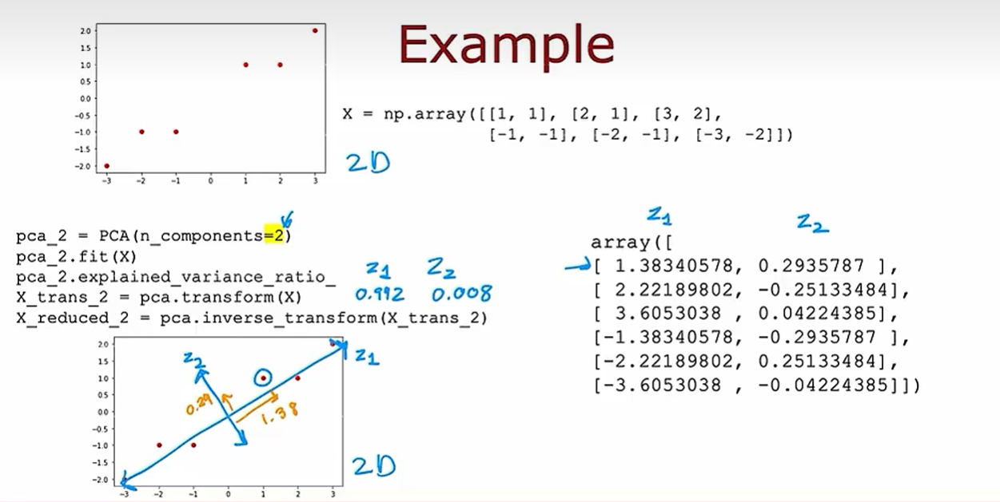
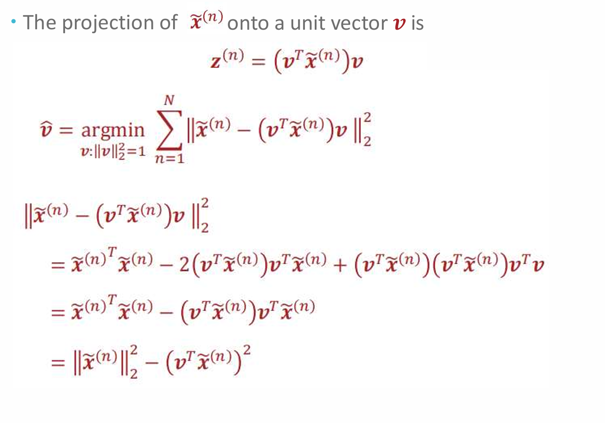

机器学习

some notation: 

1. training set: get the model from it

   x=input,y=output,m=number of training examples
   $$
   (x^{i},y^{i})上标i代表第i个训练示例
   $$
   


**supervised learning**

learn from given right answers

- classification

  predict category

  single input 

  multiple input


find the boundary line

**Unsupervised learning**

DATA only comes with inputs x,but not out put labels y.

Algorithm has to find the structure in the data.

- clustering:

  获取没有标签的数据并且尝试自动将它们分组到集群中

- anomaly detection

- dimensionality reduction

  # Linear regression

  predict a number (infinitely many possible outputs

  - linear regression

  - cost function(for only one feature)
    $$
    J(w,b)=\frac{1}{2m}\sum_{i=0}^m(\hat{y}^{(i)}-y^{(i)})^2
    $$

    $$
    J(w,b)=\frac{1}{2m}\sum_{i=0}^m(f_{w,b}(x^{(i)})-y^{(i)})^2
    $$

    最小化J(w,b)来找到最佳参数w,b.

    持续更新w，b直到最终结果收敛达到局部最小值（实际上就是找到极值点，即导数为0）

    两者的更新是同时的
    $$
    w=w-\alpha \frac{\delta J(w,b)}{\delta w}\\
    =w-\frac{1}{m}\sum_{i=0}^m(f_{w,b}(x^{(i)})-y^{(i)})x^{(i)}\\
    b=b-\alpha \frac{\delta J(w,b)}{\delta b}\\
    =b-\frac{1}{m}\sum_{i=0}^m(f_{w,b}(x^{(i)})-y^{(i)})\\
    $$

  alpha 是学习率（0到1之间）。控制更新模型参数w和b时采取的步骤大小。过小就太慢了，过大就容易跳过最小值 

  这叫做batch gradient descent：在计算grade descent的时候都要使用到所有的训练样例

  - ## 梯度下降

    Outline:

    1. start with some a,b
    2. keep changing w,b to reduce J(w,b)
    3. until near min   

  

代码：

计算代价函数在固定w与b时的值。

```python
def computeCost(X, y, theta):
    inner = np.power(((X * theta.T) - y), 2)
    return np.sum(inner) / (2 * len(X))

data.insert(0, 'Ones', 1)#再多加一列是用来计算常数b

# set X (training data) and y (target variable)
cols = data.shape[1]
X = data.iloc[:,0:cols-1]#X是所有行，去掉最后一列
y = data.iloc[:,cols-1:cols]#y是所有行的最后一列

#将XY转化为numpy矩阵进行计算
X = np.matrix(X.values)
y = np.matrix(y.values)
theta =np.matrix(np.array([0,0]))#这里theta取二维是因为要与X的维度保持一致
computeCost(X, y, theta)

def gradientDescent(X, y, theta, alpha, iters):
    temp = np.matrix(np.zeros(theta.shape))
    parameters = int(theta.ravel().shape[1])#要求的是X有多少个特征值
    cost = np.zeros(iters)
    
    for i in range(iters):
        error = (X * theta.T) - y#这是数组的算法最后得到的还是个数组
        
        for j in range(parameters):#第j项特征值(实际上就2项 j=0,1
            term = np.multiply(error, X[:,j])#两个数组形状相同的进行每一项对应相乘形成一个新的数组对于求常数而言乘的X【：，0】=1
            temp[0,j] = theta[0,j] - ((alpha / len(X)) * np.sum(term))
            
        theta = temp
        cost[i] = computeCost(X, y, theta)
        
    return theta, cost

```

多元线性回归的梯度下降算法：

**vectorization：**

w=[b,w1,...,wn]

x=[1,x1,...,xn]

对于多个特征：

x=\[[1,x_1^1,x_2^1,...x_n^1],

[1,x_1^2,...],

...,

[1,x_1^n,...]]


现在把cost function写成(for n features)
$$
J(\vec{w},b)
$$


>  如何选择w_1,w_2

当x_1比较大，当w_1出现非常小的变换都会对成本函数产生比较大的变化，所以w_1会比较小。

此时的contours就会变成窄窄的椭圆，之后会反复弹跳选择合适的w。

目标是把它转化为一个标准的圆，也就是把x_1和x_2数量范围尽量统一


- feature scaling:

  目标是让每个x_j的范围尽量接近（不要有数量级差距）

  - mean normalization

  - $$
    x_1\in[a,b]\\
      x_1=\frac{x_1-\mu_1}{b-a}
    $$

  - 直接除以b

    

  - z-score

    

  

- 判断梯度下降是否收敛

  

- 如何选择学习率：

倾向于选择小的alpha，能确保成本函数递增，但是太小的alpha最终会使成本函数收敛时间会增长。


- feature engineering:调整原有的feature或形成新的更好的feature

  比如有时候只有x^2,那么y最终会下降，但是预期是上升，所以采用会更合理，，并且对于数量级不同的x^2和x^3，可以用feature scaling来进行优化。


假设点到直线距离符合正态分布：


```
loss = len(distances)/2 * np.log(2*np.pi*sigma**2) + np.sum(distances**2)/(2*sigma**2)
```

# Logistics Regression

sigmod function：


$$
regression \ mode：
f_{\vec{w},b}(\vec{x})=g(\vec{w}.\vec{x}+b)=\frac{1}{1+e^{-(\vec{w}\vec{x}+b)}}\\
f_{\vec{w},b}(\vec{x})=P(y=1|\vec{x};\vec{w},b)
$$
将模型的结果看成y=0或1的概率

- **decision boundary:**

​	z=wx+b=0

假设让P>0.5,y=1，那么z大于0时，y=1,而z=0 is decision boundary

- cost function
  $$
  J(\vec{w},b)=\frac{1}{m}\sum_{i=1}^{m}L(f_{\vec{w},b}(\vec{x}^{i},y^{i}))
  $$
  

  

  

当y事实上是1，而f预测出来概率只有0.1，此时的loss会很大。但是当f预测出来y有100%的概率会是1，那么loss就是0.

这样的cost function就是convex，从而能到达全局最小

- 如何找到更好的参数w，b，形式看上去和线性回归很像，但是预测函数不同。


feature scaling also works!


- overfitting =high variance

- underfitting=high bias

  很容易受噪声影响：

  

  

  

  解决方法：

  1. collect more data

  2. use fewer feature（采用最有用的feature）

     原本f(x)=x_1+x_2^2+x_3^3+...

     改为f(x)=x_1+x_3^2就可能会

  3. **regularization**

     保留所有的feature并避免有feature产生过大的影响。即使涉及到了高阶多项式，也可以通过减小各项之前的参数来减弱overfit。

      new cost function
     $$
     J(\vec{w},b)=min(\frac{1}{2m}\sum_{i=1}^m (f_{\vec{w},b}(\vec{x^{(i)}})-y^{(i)})^2+\frac{\lambda}{2m}\sum_{j=1}^n w_j^2)
     $$
     \lambda 的选择能balance 两部分（尽可能让偏差变小的同时，不会出现overfit，也就是让各个系数都尽可能小），但如果说x都取得特别特别小，那么就会造成欠拟合。

     - regularized linear regression

        

     - regularized logistic regression

       

​		

向量化：

维度：m个样本，n个特征


Xtheta是各个特征乘上各自权重的线性组合：

*号指的是各个位置对应相乘


正则化分情况对theta做：


multiple classification:


logistic perception 的优势：还能描述样本出现的不确定性（P(y|theta)).perception 只会在分类错误的时候进行更新。但是Logistics分类的时候，是即便分类正确，但是为了让MLE更大，让loss更小，还是会更新参数。

# Neural network

神经网络neural network：

通过学习自己的特征来形成更好的特征进行逻辑回归，从而做出更准确的判断。

参数的上标代表着在第几层。每一层的输出是下一层的输入


activation function：g()可以是sigmoid

以上都是forward propagation(向前传递)


- build a neural network

  1. 

  ```py
  x=np.array([[200.0,17.0]])
  layer_1=Dense(units=3,activation="sigmoid")
  a1=layer_1(x)
  ```

  2. sequential

     ```py
     x=np.array([[200.0,17.0]])
     y=np.array([1])
     layer_1=Dense(units=3,activation="sigmoid")
     layer_2=Dense(units=1,activation="sigmoid")
     model=Sequential([layer_1,layer_2])
     model.compile(...)
     model.fit(x,y)
     model.predict(x_new)
     ```

     .fit(),let tensflow take the neural network stringed together by diff layers and train it on data X and Y.And we can omit the procedure a1 a2 ...

     more commonly write:

     ```py
     model=Sequential([
     Dense(units=3,activation="sigmoid"),
     Dense(units=1,activation="sigmoid")
     ])
     layer_1=Dense(units=3,activation="sigmoid")
     layer_2=Dense(units=1,activation="sigmoid")
     model.compile(...)
     model.fit(x,y)
     model.predict(x_new)
     ```

  3. 具体的实现：

     W[:,j]取出第j列的每一行


激活函数的不同选择，如果想让a更大的话：rectified linear function：（ReLu）g（z）=max（0，z）

如何选择？

1. 在输出层：

二元分类：sigmoid y=0/1

regression：linear function y=+-

ReLu: y>=0


2. 在hidden layer：

   建议使用ReLu function：

   原因：平坦部分只有一半，而不是像sigmoid有两部分，做梯度下降会优化一点，同时计算比sigmoid简单。

   

## 多分类问题


### Softmax：

如何计算output：


loss function：


TensorFlow：


改进的代码版本：解决四舍五入的误差问题：


## Multi-label Classification


和多分类问题区分开来。这里是相当于把一张图片上同时检测是否还有car、bus和人行道。

## Optimizer：

Adam：（自动优化learning rate，会比梯度下降更快）


## Additional Neural Network Concept：

CNN：

Each neuron only looks at part of the previous layer's inputs.


# Evaluate Model

Split the train set into three part:


 


in different model, choose para based on train set , and select the model with the min J_cv, and estimate generalization error using test set.


J_cv in classification can simply be defined as the error rate.


Bias/Variance


拟合的多项式维度越高，越能fit训练集。

也有可能会部分overfit trainset，部分underfit trainset最终同时出现高偏差和高方差


如何选择正则项的lambda：

1. large lambda:

   w will be very small in this case and the predict y will be b approximately.

2. small lambda:

   Similarly no regularization, J_cv will be larger than J_train.

   

   different lambda will result in different w,b

   

   有的时候样本就是有很多噪音，无法期待error很小，那么就需要baseline作为评判参考。


High bias:

If a learning algorithm suffers from high bias, getting more training data will not help much. 

High variance:

getting more data will help.


Debugging a learning algorithm:


Neural networks and bias variance:


With  proper regularization， a larger neural network never hurt(with more hidden layer)

# Decision Tree

- discrete

one hot encoding:


- continuous feature:

  拆分时，只需要考虑different value to split on,carry out the usual information gain caculation and decide to split on the one giving the highest information gain


- tree ensemble

  **Problem:**

  ​	Once change one train example,will build a totally different tree.

  ​	Such algorithm is not robust. But with a bunch of decision trees,will be more accurate. Once get a new test example, let the trees vote.

  ​	

  **Solution:**

  - **sampling with replacement:** construct a new training set.

  - Why: explore small changes of the data and average it,so that little change further to the training set make it less likely to have a huge impact on the overall  output of the overall random forest algorithm.

  - RNDOM FOREST：

  how to generate a tree ensemble:

  B：#number of decision trees, when B beyond a certain point, you end up with diminishing returns.

  

   

  - Randomizing the feature choice:

  for lager n:

  

  ​	k tipically:\sqart{n}

​	

- XGBoost:

  

  

  


# K-means

Clustering：自动找相似的数据

 


K-means：

- 随机猜测cluster的中心在哪里【cluster centroids】

  

1. 将点分配给cluster centroids

   

   遍历样本中的每一个点，查看它是否更接近与红的centroid还是蓝的centroid

2. 移动 cluster centroids

   计算所有红色点的平均位置设置为新的centroids。蓝色同样。

   再次重复步骤一，检查所有样本点是否更接近于centroids
   
   

当最后centroids的位置不再变化。会收敛。


计算情况，如果说有一个聚类里面没有任何样本，那么不要这个聚类了，K-=1.

cost/distortion function：


每个样本点到聚类距离平方之和的最小值。

为什么求均值能最小化cost function？

基本不等式


- initialize K-means：

  random initialization

  Randomly pick K training examples.多次随机开始选择并选取其中计算出的J最小的那个分类。

  

  先随机选择一个点再取其他相距最远的点，但是可能会受到outlier的影响。

  

  第一个点也是随机选择，周围的点被选中成为中心的概率与第一个被选到的距离成正比，可以处理outlier。

- choose the number of clusters:

  自动选择的一些方法：

  elbow method（不是很好）

  手动选择需要权衡精细度和成本

# Anomaly Detection

需要fit的model是概率模型


 


real-number evaluation：

monitor example：

将异常sample分到validation set和test set上能帮助更好的调整epsilon的大小，如果异常样本量太小，就只放到validation上（但没有办法来验证这个算法到底做的怎么样）

既然有了标签（知道是不是异常事件）为什么不直接用监督学习的方法？

异常事件检测：当异常事件数量少，并且当未来的异常可能与目前得到的异常事件不一样。相当于从正常事件里学习eg：花样层出不穷的诈骗

监督学习：相当于从异常事件来学习，假设未来遇到的异常事件会和学习的异常事件相似eg：模式固定的spam email


特征选择：

让特征分布变成高斯从而更好拟合。 

如果有异常事件没有被检测到，可以尝试加入其他feature


# Recommand system


目标是预测用户会如何评价他们没看过的电影。

算法设计：

预测人物j对电影i的评分，引入电影特征向量x：
$$
j's\ rating: w^j.x^i+b^j
$$


仅对用户评分过的电影进行计算损失。


如果没有feature描述怎么办：
Collaborative filtering:

从数据中learn feature，即是一部怎样的电影让用户打出了这个评分体系。之所以能够猜测feature是因为存在不同的用户，但在前面的linear regression中，是没办法仅靠一个用户就提取数据特征的。

根据已经知道的用户评分和假设的w来取某个x最小化cost function：


再结合上面的cost function：


Gradient Descent：


binary label:喜欢还是不喜欢


loss：

均值归一化:mean normalization

 对于没有对任何电影进行评分的新用户，初始化w和b都是0的话，那么预测他的分数都是0，这不是预期的结果。

对每个电影计算平均分数。


这样就把猜测的分数设置为了均值

finding related items

 找到特征值相差最小的


limitations：

- 冷启动

对于新项目

对于新用户

- 使用了side information


## Content based filtering algorithm


content...:用户和物品都有特征向量。


两个向量可能数据大小很不一样。


但是做点积的时候两个向量大小要一样。所以可以用神经网络来提取一定维度的特征。（神经网络降低维度）


大型目录中的推荐

1. retrieval

   

2. ranking

   


# PCA

主要成分分析

减少特征数，帮助可视化数据。

原理：因为有的时候一个特征变化明显，但是另一个特征相比起来就变化甚微这个时候会考虑去掉变化不明显的特征。

有的时候几个特征都很重要就会去找新的坐标轴和坐标俩整合多个特征


方法：


选择一个轴取映射，这个轴信息squished，挤在一起，信息量就缺少了。


用点积计算映射到轴上的距离

每次选取的轴都和前面所有的轴垂直


reconstruction：

根据映射长度回推坐标。



所谓的PCA就是将原数据投影到原空间的一个子空间，并使得其保留的信息尽可能多

应用：减少特征数量让监督学习算法更快。


协方差：不同特征之间的关系。


优化的函数：

第一步先中心化x，这样能让v从原来开始，简化计算。


minimize reconstruction error=maximize x 在v方向上投影的方差。




接下来再加上一个限制条件确保v是单位向量。

于是能得到lambda是XTX特征值，v是特征向量


这个公式代表的是方差贡献率。variance总共取的更少，丢掉的不重要的东西越多，但在小的variance下还留存的特征一定是比较重要的。

具体过程： 
