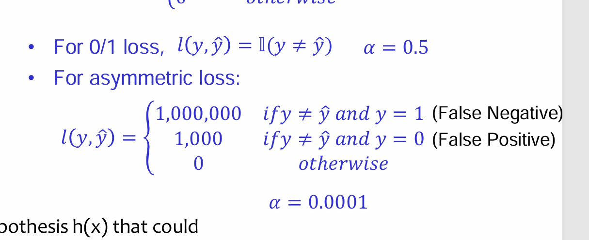
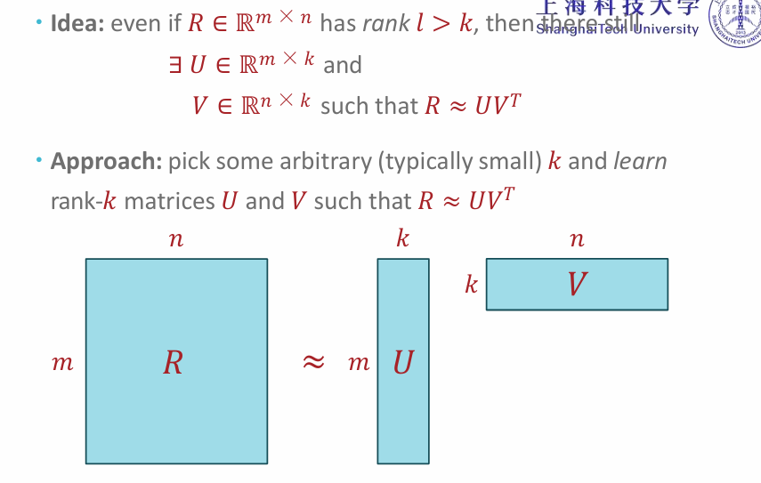
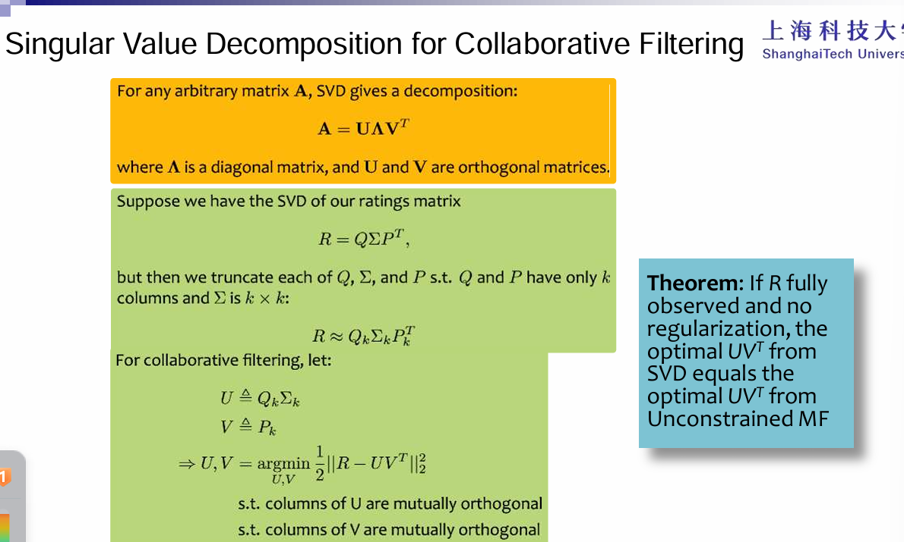

Notation：

D个不同的feature对应一个label y

 Step1:

training– Given:labeled training dataset

– Goal:learn a classifier from the  training dataset •

 Step2:

prediction– Given:unlabeled test dataset : learned classifier

– Goal:predict a label for each  instance • 

Step3:

evaluation– Given:predictions from Step II : labeled test dataset

– Goal:compute the test error  rate (i.e. error rate on the test  dataset)

evaluation:

error rate：计算出来不相等的时候。

classifier：

- majority vote：只预测结果为train set中最多次出现的结果
- memorizer：如果出现了与训练集中相同的feature那么根据他对应的label来预测否则采用1.所以对于train error是0.
- decision stumps：based on a single feature,𝑥𝑑,predict the most common label in the training dataset among all   data points that have the same value for 𝑥d

# decision tree：

如何选择splitting feature：

- min error rate

- max mutual information:

  > entrophy:代表了事件的不确定性。

  

如何选择splitting feature的顺序：

每一个splitting feature都遵循这个原则，找最大的mutual information，递归算法。

什么时候结束：

限制树的深度和设置threshold是为了避免overfit。

overfit：true error>train error

train accuracy在增加，而validation accuracy在降低。

given a decision tree,how to decide it is the best one?

remove every node (using majority vote (according to **training data set**))to decide it's result label)and compute the final error rate,if we can find a better rate, then it is not the best decision tree.When  to stop? Cut every point and an not be better.

Duck Test:

把一个点分类到离他最近的点的种类：

1. 曼哈顿距离
2. 欧几里得distance

# KNN：

determine distance function

get the k nearest points in train data, and using Majority vote to select the right label.

The training error rate must be 0.

if k=even ,and encounter ties(with # of labels equal, majority vote does not work), consider change distance function/count another point/select the nearest distance.

feature scale matters!

if k Is very small,risk of overfitting.

when k becomes larger,decision boundary will become smooth.

if k is very big, underfitting.

Model Selection:

decision tree:

model:set of all possible decision trees

parameter: structure of a specific decision tree

learning algorithm: how to select the splitting parameter

hyperparameter:learning sl not decide but the tunable aspects of thhe model: depth

knn:

model:

parameter: no

learning algorithm: no

hyperparameter:k

perception has no hyperparameter.

cross-validation:

N-fold: seperate data set into N folds and every time estimate the error on leave out one fold by training  N-1 folds.

train-original=[train-subset]+[validation],pick the best hyperparameters give the lowest erro on[validation] and use it on {train-original} later.

hyperparameter optimization:

- grid search

  sample points(按照固定间隔踩点，所以有可能会跳过最优解)

​	consider all combinational cases

- random search（ recomended

  given time and randomly combine all hp(因为可以选到更多的取值)

# Perception：

1. 对于线性可分

当数据集里含有一些错误的example，Perception will overfit

decision boundary should be linear

margin:The margin 𝛾 for a dataset D is the greatest possible distance between a linear separator and the closest data point in Dtothat linear separator.

for linearly separable data,  perceptron algorithm  will converge in a finite steps..

Perception mistake bound:

x维数不影响，整体放大n倍也不影响。中间margin越大，那么...

2. 线性不可分

   - kernal

     

     

     

     首先可以把w表示成（每次更新w都是+、-x）

     

     

     映射到高维空间让它线性可分

     什么时候能用kernal：

     
     
     性质：
     
     1. 对称矩阵
     
     2. 半正定：
     
     3. 
     
     4. 
     
        

# Support Vector Machines

优化：

目的：找到一个最优平面最大化类别边界（margin）

1. 线性可分

   方法：

   - 设置w为决策边界的法向量，模长设置为1，那么点到直线距离就是|w.x|
   - 由上文，margin越大，试错成本越小，于是我们需要找一个最大的margin让所有x到直线的距离都比他大。
   - 

   reformulate，原因：由于||w||^2不是一个凸函数，不好求优化

   转换后的问题：

2. 不是线性可分

   松弛变量：
   
   转换为对偶问题，只含点积，使用kernal：
   
     因为松弛变量是非负的，因此最终的结果是要求间隔可以比1小。但是当某些点出现这种间隔比1小的情况时（这些点也叫离群点），意味着我们放弃了对这些点的精确分类，而这对我们的分类器来说是种损失。所以要更正损失函数
   
   如何使用kernal：
   
   
   
   可供选择的kernal函数：
   
   对于rbf：
   
   - **`gamma` 大（如 `gamma=10`）**：核函数衰减快，模型更关注邻近样本，易过拟合（复杂边界）。
   - **`gamma` 小（如 `gamma=0.01`）**：核函数衰减慢，决策边界平滑，易欠拟合。
   
   损失函数：
   
   

# Linear Regression

residuals: the vertical distance from y^ and y

Stochastic Gradient  Descent：

计算的是整个dataset对J的倒数。

SGD：是只看sample的那一个data point对J的导数。

S有更多更新参数的机会，在前期能够收敛地更快并且时候数据量大的训练集。

正则化：

# MLE\MAP:

MLE: Choose theta that maximizes the probability of observed data

For Gaussian func

map: Choose theta that maximizes the posterier probability.

Conjugate:

coin flippng:Binomial distribution. 

当sample够多，那么就会冲淡prior的影响。

MLE在Logistic regression中的应用：

根据给的训练集，找到最优的w让这种training的模式的出现概率最大化。

那么损失函数可以看成上面的取符号，最小化这个就可以。

逻辑回归的决策边界是

p(x|theta)=sigmoid（wx）=a

a由bayes optimal classifier决定。

Bayes Optimal Classifier

0/1 loss：不可导，一般用来做评估。

Logistics的loss可导（log-loss），可以做梯度。

Model Performance Metrics

 **Accuracy** is useful for evaluating classification model when classes are balanced ( binary or  multi-class classification).  When classes in the dataset are highly imbalanced, meaning there is a significant disparity in  the number of instances between classes, accuracy can be misleading. 

Precision：

更加关注是否分类正确了positive的内容,即希望判断为正样本时候这个样本的确是正样本。eg：推送正确了用户喜欢的内容，减少将用户讨厌内容推送成用户喜欢的。

Recall：

eg：不能放过阳性病例。

Feature engineering

原来的feature在原来的空间没办法拟合做回归，那么可以考虑使用： **Nonlinearbasis functions** allow linear models(e.g. Linear  Regression, Logistic Regression) to capture nonlinear  aspects of the original input

当x升维之后，容易出现overfit，但是也可以通过增加样本量来减少。

调整方法：Regularization：

 why we should not regularize the bias term：

- 如果对偏置项进行正则化，优化过程会倾向于将 b*b* 推向零（尤其是L2正则化）。这相当于强制模型必须通过原点（y=wx*y*=*w**x*），**限制了模型的表达能力**。
- 许多数据本身不适合“通过原点”的假设（如数据分布的实际截距非零），强制 b*b* 变小会导致模型需要扭曲权重 w*w* 来补偿，反而降低性能。

如果希望w里出现0，使用L1，L1loss不是凸函数，没有closed solution。

L1：subdifferentiable(not sifferentiable at 0)

如果想让w更sparse，用L2，L2loss还是有closed

# Neural Network

分类问题：最后一层用sigmoid

回归问题:最后一层做线性求和	

神经网络没有唯一的最优解。

二分类最后一层就是1个神经元，多分类问题最后一层要有多个神经元，

理论上，一层hidden layer可以拟合出任何变换。

神经网络也需要loss function和梯度下降。

前向传播：

通过最后的结果计算loss。

后向传播：

用链式法则更新w，t代表第几次迭代

考虑正则化：

w对loss的影响从两个分支进行。

对于最后一层，只取最大的那个  

## 导数计算公式：

input shape是什么，导数shape就是什么。

例题：（注意维度）

# Metric：

1. **precision（精确率）**
   - 计算公式：`TP / (TP + FP)`
   - 含义：模型预测为某类的样本中，**实际属于该类的比例**。
   - 例子：对于 `Ariel Sharon`，精确率 0.62 表示模型预测为 Ariel Sharon 的样本中，62% 预测正确。
2. **recall（召回率，又称灵敏度）**
   - 计算公式：`TP / (TP + FN)`
   - 含义：实际属于某类的样本中，**被模型正确预测的比例**。
   - 例子：`Ariel Sharon` 的召回率 0.72 表示真实属于该类的样本中，72% 被模型正确识别。
3. **f1-score（F1分数）**
   - 计算公式：`2 * (precision * recall) / (precision + recall)`
   - 含义：精确率和召回率的**调和平均数**，综合两者表现（尤其适用于类别不平衡数据）。
   - 例子：`Ariel Sharon` 的 F1 分数 0.67 是其精确率和召回率的平衡结果。
4. **support（支持数）**
   - 含义：测试集中**实际属于该类的样本数量**。
   - 例子：`George W Bush` 的 support 为 146，表示测试集中有 146 张他的照片。

# CNN

- **1. CNN的核心思想**

  

- **局部感知**：不像全连接网络那样每个神经元连接所有输入，CNN的神经元只感受输入的局部区域（如3×3像素块），更适合捕捉图像中的局部特征（边缘、纹理等）。

- **权重共享**：同一卷积核（filter）在图像上滑动时共享参数，大幅减少参数量。

- 

  在卷积层中每个神经元连接数据窗的权重是固定的，每个神经元只关注一个特性。神经元就是图像处理中的滤波器，比如边缘检测专用的Sobel滤波器，即卷积层的每个滤波器都会有自己所关注一个图像特征，比如垂直边缘，水平边缘，颜色，纹理等等，这些所有神经元加起来就好比就是整张图像的特征提取器集合。

  一组固定的权重和不同窗口内数据做内积: 卷积

  

  

  

kernal需要保证和原图的channel保持一致：

RGB为3，kernal就要3	

计算outputsize：

​	如果有填充p，那么就是（N+2p-F），N是原来的维度，F是kernal的维度。

> 因为卷积最后的图像大小是由较小的维度决定的，所以会想到加入padding

如果kernal是1\*1*n，那么可以调整n进行升维降维。

做完conv之后，因为目前为止都是线性变化，为了能处理非线性操作，就用激活函数将线性拟合到非线性，每一个点套上激活函数。之后再做池化。

- Pooling layer：

  池化层夹在连续的卷积层中间， 用于压缩数据和参数的量，减小过拟合。
  简而言之，如**果输入是图像的话，那么池化层的最主要作用就是压缩图像。**

  这里再展开叙述池化层的具体作用：

  1. **特征不变性**，也就是我们在图像处理中经常提到的特征的尺度不变性，池化操作就是图像的resize，平时一张狗的图像被缩小了一倍我们还能认出这是一张狗的照片，这说明这张图像中仍保留着狗最重要的特征，我们一看就能判断图像中画的是一只狗，图像压缩时去掉的信息只是一些无关紧要的信息，而留下的信息则是具有尺度不变性的特征，是最能表达图像的特征。

  2. **特征降维**，我们知道一幅图像含有的信息是很大的，特征也很多，但是有些信息对于我们做图像任务时没有太多用途或者有重复，我们可以把这类冗余信息去除，把最重要的特征抽取出来，这也是池化操作的一大作用。

  3. 在一定程度上**防止过拟合**，更方便优化。

     max pooling：

CNN的数学特性：

图片做平移，特征提取也会平移。但是做旋转就找不到特征了。

对于一层卷积层，可以有等变形，但是做了池化之后就对未知不敏感了。

## GoogleNet：

先pool再做1*1 conv，与先做11conv再做pool最后拿到的feature map是一样的。但是先做pool运算会少一点。

**梯度消失**：当网络很深的时候，gradient会非常小，这时候几乎就没有更新。链式求导法则，导致浅层的weight是由深层的weight连乘，因为这里w在0到1，所以不断连乘只会越来越小。

**梯度爆炸**：gradient变得越来越大，因为w大于1。

google的解决：

在浅层网络就连接一个输出。

ResNet：

DenseNet：

# Semantic Segmentation 

loss function:

类似前面的

# Recommandation:

**Content filtering：**

**Collaborative Filtering:**

可以不需要产品信息和user信息，只是基于user item matrix

只需要矩阵

Commoninsight:personaltastesarecorrelated– IfAlice andBobbothlike XandAlicelikes Ythen Bobismorelikely to  like Y– especially (perhaps)if BobknowsAlice

1. neighborhood methods:

​	

2. latent factor method

   不需要side infomation

   

   矩阵分解：

   

   

   通过学习train，得到UV成绩来预测空白部分。

   

   History：怀旧的人

   ro：浪漫的人

   列是不同的电影。

   E是要求的矩阵和U乘VT的相差矩阵

   1. unconstarined：

      low-rank MF：

      

      

      ​	

      需要优化的目标函数是
      $$
      E=R-UV^T\\
      Z={(i,j):R_{i,j}known}\\
      \frac{1}{2}||E||^2=\frac{1}{2}\sum_{i,j\in{Z}}(R_{i,j}-U{i,.}V_{.,j}^T)^2
      $$
      参数更新：

      

      

      

      如果说知道user 的偏爱

      那么可以通过加上bias O和P

   2. SVD：

      

   3. Nonnegative Matrix Facorization：

   

   

# AdaBoost

Def:a weak learner is onethatreturns a hypothesisthatis not much better than random guessing 

Def:a strong learner is one that returns a hypothesis of arbitrarily  low error

[AdaBoost](https://so.csdn.net/so/search?q=AdaBoost&spm=1001.2101.3001.7020)是典型的Boosting算法。

[Boosting算法](https://so.csdn.net/so/search?q=Boosting算法&spm=1001.2101.3001.7020)是将“弱学习算法“提升为“强学习算法”的过程，主要思想是“三个臭皮匠顶个诸葛亮”。

一般来说，找到弱学习算法要相对容易一些，然后通过反复学习得到一系列弱[分类器](https://so.csdn.net/so/search?q=分类器&spm=1001.2101.3001.7020)，组合这些弱分类器得到一个强分类器。

**1. 加法模型**

加法模型就是我们最终的强分类器是若干个弱分类器加权平均而得到的（弱分类器线性相加而成）。

**2. 前向分步算法**

前向分步就是我们在训练的过程中，下一轮迭代产生的分类器是在上一轮的基础上训练得来的。

我们的算法是通过一轮轮的弱学习器学习，利用前一个弱学习器的结果和当前弱学习器来更新当前的强学习器的模型。也就是说：

第*k*−1轮的强学习器为:
$$
f _
k
​
 (x)=f _{k−1
}

​
 (x)+α _
k
​
 G_ 
k
​
 (x)
$$
Adaboost:

这里的集合起来的策略是通过提高前一轮分类器分类错误的样本的权值，降低分类分类正确的样本权值，对于那些没有本分类正确的样本会得到后面分类器更多的关注。然后可以产生很多的弱分类器，通过多数加权投票组合这些弱分类器，加大误差率小的分类器，减少误差率大的分类器，使其在表决中起到较少的作用。

1）初始化训练样本的权值分布，每个样本具有相同权重；

（2）训练弱分类器，如果样本分类正确，则在构造下一个训练集中，它的权值就会被降低；反之提高。用更新过的样本集去训练下一个分类器；

（3）将所有弱分类组合成强分类器，各个弱分类器的训练过程结束后，加大分类误差率小的弱分类器的权重，降低分类误差率大的弱分类器的权重。
$$
T={(x 
1
​
 ,y 
1
​
 ),(x 
2
​
 ,y 
2
​
 ),...,(x 
m
​
 ,y 
m
​
 )}\\
 D(k)=(w 
k1
​
 ,w 
k2
​
 ,...,w 
km
​
 );w 
1i
​
 = 
m
1
​
 ;i=1,2,...,m\\
$$

当误差越大，ak越小。这个分类器所占的权重就越小。

注意到初始data的权重是均匀分布

不会造成overfitin：因为不是maximize accu而是在maxmize margin：

因为weight每次更新都是有normalize的所以误差的correct和wrong加和就是1.

**Adaboost的优点：**

1）Adaboost作为分类器时，分类精度很高；

2）在Adaboost的框架下，可以使用各种回归分类模型来构建弱学习器，非常灵活；

3）作为简单的二元分类器时，构造简单，容易实施，结果可理解；

4）不容易发生过拟合。

**Adaboost的缺点：**

1）对异常样本敏感，异常样本在迭代中可能会获得较高的权重，影响最终的强学习器的预测准确性；

2）训练时间过长，每次一个分类器都要用全部样本学习，对于弱分类器学习来讲，时间及速度上影响不大，强分类器的学习时间会就会比较大。

从线性简单模型到非线性模型。

# Bagging

随机选取subset

1. (sample) bagging 

2.  feature bagging(aka. randomsubspacemethod) 

3. randomforests(whichcombinesamplebaggingandfeaturebaggingtotraina  “forest” of decisiontrees)：

   因为Decision Tree 很容易受到数据变化的影响。

   

   即使是subset样本数和原来的trainset的样本数一样，也会因为重复选取了样本数聚焦于不同的输入空间。

   

   每次分支选取feature，随机选取subset个，其中选出最优的那一个（mutual information）

生成B个Decision tree。

怎么去选取超参数B，rou。用validation set做测试。

这里直接把每个决策树没有训练过的sample来做测试。比cross vali好的一点是不需要训练多个森林。

如果多个tree里频繁用到了某个feature，或者多个tree用了某个feature之后，平均下来uncertainty下降的平均值是多少。或者去除这个feature看看对performance的影响。

实验：控制变量。

# Guassian Mixture Models

**高斯混合模型（GMM）** 是一种概率模型，用于表示由多个高斯（正态）分布组合而成的数据分布。它假设数据是由 **K 个高斯分布** 以一定权重混合生成的，常用于 **聚类、密度估计、异常检测** 等任务。

知道是什么类别就可以做MLE

# PCA

​	
